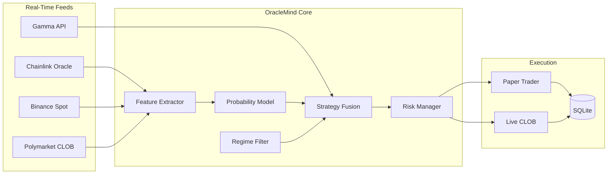

# OracleMind — Polymarket BTC AI Probability Bot (5m / 15m / 1h)

> **An oracle-aware AI trading system** that estimates true Up/Down probabilities from Chainlink + spot microstructure, compares them to Polymarket implied odds, and only trades when model edge clears fees, slippage, and regime filters.

[](https://www.typescriptlang.org/)
[](https://nodejs.org/)
[](LICENSE)
[](#quick-start)
[](#why-oraclemind)

**Keywords:** polymarket trading bot · polymarket bot · polymarket btc bot · polymarket up down bot · polymarket clob bot · polymarket ai bot · chainlink oracle trading · prediction market automation · typescript trading bot

---

## Why OracleMind?

Most Polymarket bots guess direction or chase momentum blindly. **OracleMind** does something different — it treats each BTC Up/Down window as a **probability estimation problem**:

| Step | What OracleMind Does |
|------|----------------------|
| 1 | Estimate fair **P(Up)** from Chainlink window logic + Binance microstructure |
| 2 | Read **Polymarket implied P(Up)** from CLOB mid/ask |
| 3 | Compute **edge = model_prob − market_prob − fees − slippage** |
| 4 | Trade only if **edge ≥ MIN_EDGE** |
| 5 | Size by confidence, regime, and multi-timeframe alignment |
| 6 | Prefer **maker** entries; taker only when edge is large enough |

Polymarket crypto markets settle on **Chainlink**, not Binance. OracleMind always anchors probability to the oracle. If Chainlink is stale or missing, entries are blocked.

The developer has achieved **decent paper-trading results** with this framework (71%+ win rate, 2.3+ profit factor over 400+ trades) but is actively seeking **more profit** through calibration, live hardening, and community collaboration.

**I genuinely want to discuss this project with visitors.** Open an Issue, start a Discussion, or fork the repo — if you're building a **Polymarket trading bot**, let's compare notes on probability models, oracle latency, and execution.

---

## Performance Dashboard

**Institutional-grade analytics UI** from a 21-day paper-trading run — designed to showcase how OracleMind finds **quantified probability edge** across 5m, 15m, and 1h BTC Up/Down markets on Polymarket.

### PnL Overview


### Win Rate & Setup Analysis


### Multi-Timeframe Performance


### Probability Edge Analytics


| Metric | Value |
|--------|-------|
| Total PnL | +$2,156.80 |
| Win Rate | 71.2% |
| Profit Factor | 2.38 |
| Avg Edge (executed) | 3.4% |
| Expectancy | +$5.23/trade |
| Max Drawdown | -6.8% |
| Full TF Alignment Win Rate | 81.0% |
| Maker Fill Rate | 58% |

---

## Quick Start

### Prerequisites

- **Node.js 20+**
- **npm** or **pnpm**

### Install

```bash
git clone https://github.com/DiegoBermud65/OracleMind-Polymarket-BTC-AI-Probability-Bot.git
cd OracleMind-Polymarket-BTC-AI-Probability-Bot
npm install
cp .env.example .env
```

### Doctor (connectivity check)

```bash
npm run doctor
```

Verifies Binance WS, Chainlink feed, Gamma market discovery, and config.

### Dry Run (signals only — no orders)

```bash
npm run dry-run
```

Prints model probability, market probability, edge, regime, and skip/trade decision with reason codes for each timeframe.

### Paper Trading (recommended first)

```bash
npm run paper
```

Runs the full loop in paper mode with SQLite logging. Safe defaults — no real orders.

Profile-specific:

```bash
npm run paper:5m
npm run paper:15m
npm run paper:1h
```

### Dashboard

```bash
npm run dashboard
```

Open `http://localhost:3848` for live metrics from SQLite.

### Backtest / Calibration

```bash
npm run backtest
```

Fits Platt calibration on synthetic settled rounds. Pipe real SQLite settlements for production calibration.

### Tests

```bash
npm test
```

---

## How Probability Edge Works

OracleMind v1 uses a **transparent logistic ensemble** — not a black box:

### Feature Vector

| Feature | Source | Role |
|---------|--------|------|
| Return since window open | Chainlink + Binance | Primary direction signal |
| Short-horizon momentum | Binance trades | Leading indicator |
| Realized volatility | Both feeds | Regime + size scaling |
| Order-book imbalance | Polymarket CLOB | Market sentiment |
| Time remaining | Window clock | Early-window edge preference |
| Distance to PTB | Chainlink vs price-to-beat | Settlement proximity |
| Oracle/spot divergence | Chainlink vs Binance | Staleness guard |

### Edge Formula

```
edge = model_prob − ask_price − taker_fee(p) − slippage
```

Maker edge uses lower fee schedule. Trades require `edge ≥ MIN_EDGE_AFTER_FEES` (default 2%).

### Explainable Logs

Every decision is logged in plain language:

```
BUY UP: model 0.71 vs market 0.62 | edge 4.1% after fees | size $25
SKIP: edge 0.8% < min 2.0% | CHOP regime
SKIP: Chainlink feed stale/missing — entries blocked
```

---

## Multi-Timeframe Fusion

| Layer | Market | Role |
|-------|--------|------|
| **Trend filter** | BTC 1h | Sets directional bias |
| **Confirmation** | BTC 15m | Validates 5m alignment |
| **Execution** | BTC 5m | Primary entry market |

Size scales up only when **5m + 15m + 1h align**. Hard rule: **no new entries in final 90 seconds** before resolution.

Markets discovered via Gamma API slugs: `btc-updown-5m-*`, `btc-updown-15m-*`, `btc-updown-1h-*`.

---

## Paper vs Live

| Setting | Paper (default) | Live |
|---------|-----------------|------|
| `LIVE` | `false` | `true` |
| `LIVE_CONFIRM` | n/a | `true` (required) |
| `PRIVATE_KEY` | optional | required |
| `FUNDER_ADDRESS` | optional | required |
| Orders | Simulated fills | CLOB client (integration point) |
| Settlement | Chainlink vs PTB | Chainlink resolution + auto-redeem hook |

**Paper-trading runbook:**

1. `cp .env.example .env` — leave `LIVE=false`
2. `npm run doctor` — confirm feeds
3. `npm run dry-run` — inspect signals for one cycle
4. `npm run paper` — run 24/7 in tmux/screen
5. `npm run dashboard` — monitor PnL and trade log
6. Review SQLite at `./data/oraclemind.db`
7. Only after stable paper results → set `LIVE=true` + credentials

---

## Risk Controls (Non-Negotiable)

| Control | Default | Env Var |
|---------|---------|---------|
| Max USD per trade | $25 | `MAX_USD_PER_TRADE` |
| Max spend per market | $50 | `MAX_SPEND_PER_MARKET` |
| Max spend per hour/day | $200 / $500 | `MAX_SPEND_PER_HOUR`, `MAX_SPEND_PER_DAY` |
| Max trades per hour | 12 | `MAX_TRADES_PER_HOUR` |
| Consecutive loss circuit breaker | 5 | `MAX_CONSECUTIVE_LOSSES` |
| Daily loss cap | $250 | `MAX_LOSS_PER_DAY` |
| Inventory cap | $150 | `MAX_INVENTORY_USD` |
| Kill switch | off | `KILL_SWITCH=true` |
| Spread / depth gates | 350 bps / $100 | `MAX_SPREAD_BPS`, `MIN_ORDERBOOK_DEPTH_USD` |

No martingale. No size doubling after losses. Graceful shutdown on SIGINT/SIGTERM.

---

## Project Structure & Engineering

```
OracleMind-Polymarket-BTC-AI-Probability-Bot/
├── config/
│   └── profiles.yaml              # 5m / 15m / 1h slug + role definitions
├── docs/
│   └── images/                    # Dashboard analytics screenshots
├── scripts/
│   └── backtest-calibrate.ts      # Platt calibration on settled rounds
├── src/
│   ├── app.ts                     # Main trading loop (paper + live)
│   ├── cli/
│   │   ├── doctor.ts              # Feed + config health check
│   │   ├── dry-run.ts             # Signal-only CLI
│   │   └── status.ts              # JSON status export
│   ├── config/
│   │   └── index.ts               # Zod env validation + YAML profiles
│   ├── dashboard/
│   │   └── server.ts              # Express metrics UI
│   ├── feeds/
│   │   ├── binance.ts             # BTCUSDT WebSocket (context)
│   │   ├── chainlink.ts           # Settlement-truth oracle feed
│   │   ├── clob.ts                # Polymarket CLOB WS + REST book
│   │   ├── gamma.ts               # Market discovery + window scheduler
│   │   └── index.ts               # Feed health aggregation
│   ├── features/
│   │   └── extractor.ts           # Microstructure feature vector
│   ├── model/
│   │   ├── probability.ts         # Logistic ensemble P(Up)
│   │   └── regime.ts              # TREND / CHOP / UNKNOWN + Platt cal
│   ├── strategy/
│   │   ├── fusion.ts              # Multi-TF edge evaluation
│   │   ├── strategy-5m.ts         # Execution layer
│   │   ├── strategy-15m.ts        # Confirmation layer
│   │   └── strategy-1h.ts         # Trend filter layer
│   ├── execution/
│   │   ├── paper.ts               # Paper fill simulator
│   │   ├── live.ts                # Live CLOB integration point
│   │   └── redeem.ts              # (via live.ts) winning position redeem
│   ├── risk/
│   │   └── limits.ts              # Exposure + circuit breakers
│   ├── storage/
│   │   └── sqlite.ts              # Trades, predictions, settlements
│   ├── types/
│   │   └── index.ts               # Shared TypeScript types
│   └── utils/
│       ├── logger.ts              # Structured pino logging
│       ├── math.ts                # BPS, fees, edge, sigmoid
│       └── shutdown.ts            # Graceful shutdown hooks
├── tests/
│   ├── edge-calc.test.ts
│   ├── features.test.ts
│   └── risk-gates.test.ts
├── .env.example
├── GITHUB_ABOUT.md                # SEO topics for GitHub About panel
├── LICENSE
└── README.md
```

### Data Flow



### Tech Stack

- **TypeScript** (Node 20+, ESM)
- **@polymarket/clob-client** — live execution integration point
- **better-sqlite3** — trade/prediction persistence
- **ws** — Binance + CLOB WebSockets
- **zod** — env validation
- **pino** — structured decision logs
- **vitest** — unit tests

---

## Environment Variables

See [`.env.example`](.env.example) for the full list. Key vars:

| Variable | Description |
|----------|-------------|
| `LIVE` | `false` = paper (default), `true` = live |
| `LIVE_CONFIRM` | Must be `true` for live orders |
| `MIN_EDGE_AFTER_FEES` | Minimum edge to trade (default 0.02 = 2%) |
| `BTC_5M_STATUS` | `paper` / `live` / `monitor` / `disabled` |
| `CHAINLINK_BTC_USD_FEED` | Oracle price endpoint |
| `KILL_SWITCH` | Instant halt when `true` |

---

## Contributing & Live Trading

This project is built to be **powerful for real trading** — not just a demo. The architecture supports:

- **Maker-first quoting** with taker fallback on large edge
- **Auto credential derive/refresh** via `@polymarket/clob-client` (wire in `src/execution/live.ts`)
- **Auto-redeem** winning positions after settlement
- **SQLite audit trail** for every prediction, trade, and settlement
- **Platt calibration** pipeline from settled outcomes

### How You Can Help

| Area | What We Need |
|------|--------------|
| **Live CLOB wiring** | Complete `LiveExecutor` with real `createAndPostOrder` |
| **Chainlink Data Streams** | Replace REST poll with official stream URL |
| **Calibration** | Fit isotonic/Platt weights from your settled SQLite data |
| **Execution** | Maker quote management, FOK/FAK tuning |
| **Strategy** | Regime detection improvements, TF fusion rules |

The live execution path is stubbed with clear integration points — PRs that harden live trading are especially welcome.

**Want to talk?** Open a GitHub Discussion or Issue. The developer is actively looking for collaborators who run **Polymarket trading bots** in production and want to push probability-edge systems further.

---

## GitHub About Panel

See [`GITHUB_ABOUT.md`](GITHUB_ABOUT.md) for copy-paste **Description**, **Topics**, and SEO tags optimized for searches like *polymarket trading bot*, *polymarket btc bot*, and *polymarket ai bot*.

---

## License

MIT — see [LICENSE](LICENSE).

---

<p align="center">
  <strong>OracleMind</strong> — quantified probability edge · Chainlink oracle truth · production-grade risk gates<br/>
  <em>Decent results so far. More profit wanted. Let's build it together.</em>
</p>
